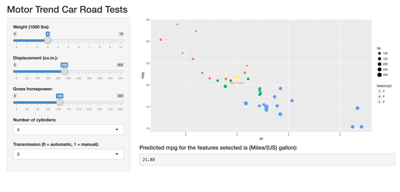

## Introduction

Main idea of this presentation is to create an app that will predict mpg of a car based on user input like number of cylinders, gross horse power, weight and transmission type.

#### Agenda
- App Interface
- Data Details
- Data Example
- Summary

## App Interface



## Data Details

###Outcome Variable
-	**mpg**	Miles/(US) gallon  

###Predictor Variables
-	**cyl**	Number of cylinders
-	**disp**	Displacement (cu.in.)
-	**hp**	Gross horsepower
-	**wt**	Weight (1000 lbs)
-	**am**	Transmission (0 = automatic, 1 = manual)


## Data Example
```{r,echo = FALSE}

NameList <- c("mpg","cyl","disp","hp","wt","am")

idx <- match(NameList, names(mtcars))

DF <- mtcars[,idx] 

summary(DF)

```


## Summary

App Link can be found here: https://panache444.shinyapps.io/Course_Assignment/

Source code for Course Project on the GitHub repo: https://github.com/panache444/ShinyApp_Coursera_Assignment
